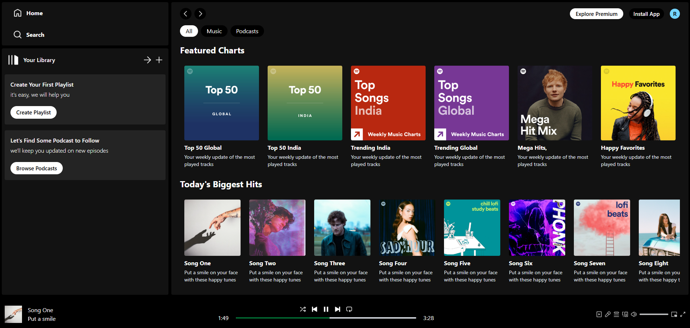

# Project Name

Spotify-Clone

## What I've learned

- using hooks like useRef, useNavigate, useLocation, useContext
- using async arrow function

## Screenshot

## Technologies Used

- HTML5
- TailwindCSS
- JavaScript
- React

## Contact

[Rizwan Siddiqui](https://github.com/RizwanSiddiqui021) - [rizwansiddiqui021@gmail.com](mailto:rizwansiddiqui021@gmail.com)
